# GTFS to Neo4j Knowledge Graph Project

This project provides a complete solution for importing GTFS (General Transit Feed Specification) data into Neo4j, creating a rich knowledge graph of transit information that can be queried and analyzed.

## 🎯 Project Goals

- **Data Integration**: Import comprehensive transit data from GTFS format into Neo4j
- **Knowledge Graph**: Create meaningful relationships between transit entities
- **Query Capability**: Enable complex queries across the transit network
- **Scalability**: Handle large GTFS datasets efficiently
- **Ease of Use**: Provide simple tools for setup and data exploration

## 🏗️ Architecture Overview

```
GTFS Data Files → Python Import Script → Neo4j Database → Query Interface
     ↓                    ↓                    ↓              ↓
  CSV Format        Data Processing      Graph Schema    Cypher
  (agency.txt,      (Validation,        (Nodes &        (Interactive
   routes.txt,       Type Conversion,    Relationships)  Queries)
   stops.txt, etc.)  Batching)
```

## 📁 Project Structure

```
knowledge-graph-datasets/
├── gtfs/                          # GTFS data directory
│   ├── data/                      # GTFS CSV files
│   │   ├── agency.txt             # Transit agencies
│   │   ├── routes.txt             # Transit routes
│   │   ├── stops.txt              # Transit stops
│   │   ├── trips.txt              # Transit trips
│   │   ├── stop_times.txt         # Stop times for trips
│   │   ├── calendar.txt           # Service schedules
│   │   ├── calendar_dates.txt     # Service exceptions
│   │   ├── fare_attributes.txt    # Fare information
│   │   ├── fare_rules.txt         # Fare rules
│   │   ├── transfers.txt          # Transfer information
│   │   ├── shapes.txt             # Route shapes
│   │   └── feed_info.txt          # Feed metadata
│   ├── gtfs_import_neo4j.py       # Main import script
│   ├── test_gtfs_data.py          # Data validation script
│   ├── sample_queries_neo4j.py    # Query examples
│   ├── neo4j_config.py            # Configuration management
│   ├── docker-compose-neo4j.yml   # Neo4j setup
│   ├── start_neo4j.sh             # Startup script
│   ├── setup_uv.sh                # Automated setup script
│   ├── Makefile                   # Project management commands
│   ├── pyproject.toml             # Project configuration
│   ├── config.env.example         # Configuration template
│   └── README.md                  # This file
```

## 🚀 Quick Start

### 1. Setup Environment
```bash
# Navigate to the GTFS project directory
cd gtfs

# Option 1: Use the automated setup script (recommended)
./setup_uv.sh

# Option 2: Manual setup
uv venv
source .venv/bin/activate  # macOS/Linux
# or
.venv\Scripts\activate     # Windows
uv pip install -e .
```

### 2. Configure Neo4j Connection
```bash
# Create configuration file
cp config.env.neo4j.example config.env

# Edit configuration with your connection details
nano config.env
```

### 3. Start Neo4j (Local)
```bash
# For local development
./start_neo4j.sh
```

### 4. Validate Data
```bash
# Using uvx (recommended)
uvx run test_gtfs_data.py

# Or using uv with activated virtual environment
uv run python test_gtfs_data.py
```

### 5. Import Data
```bash
# Basic import (will resume if interrupted)
uvx run gtfs_import_neo4j.py

# Import with custom batch size
uvx run gtfs_import_neo4j.py --batch-size 5000

# Import with custom data directory
uvx run gtfs_import_neo4j.py --data-dir /path/to/gtfs/data

# Or using uv with activated virtual environment
uv run python gtfs_import_neo4j.py --batch-size 5000
```

**Resume & Progress Management:**
```bash
# Check current import progress
uvx run gtfs_import_neo4j.py --show-progress

# Reset progress to start fresh
uvx run gtfs_import_neo4j.py --reset-progress

# Remove progress file completely
uvx run gtfs_import_neo4j.py --clear-progress
```

### 6. Resume Interrupted Imports
The import script now includes **automatic resume functionality** that allows you to continue from where you left off if the import is interrupted:

```bash
# Resume from where you left off (automatic)
uvx run gtfs_import_neo4j.py

# Check current import progress
uvx run gtfs_import_neo4j.py --show-progress

# Reset progress to start fresh (if needed)
uvx run gtfs_import_neo4j.py --reset-progress

# Remove progress file completely
uvx run gtfs_import_neo4j.py --clear-progress
```

**Resume Features:**
- ✅ **Automatic Progress Tracking**: Saves progress after each batch
- 🔄 **Smart Resume**: Skips completed entities, resumes from exact batch
- 📊 **Progress Monitoring**: Real-time status updates
- 🛡️ **Fault Tolerance**: Handles interruptions gracefully
- ⚡ **No Duplication**: Never re-imports completed data

### 7. Explore Data
```bash
# Using uvx (recommended)
uvx run sample_queries_neo4j.py

# Or using uv with activated virtual environment
uv run python sample_queries_neo4j.py
```

## 🔧 Core Components

### GTFS Import Script (`gtfs_import_neo4j.py`)
- **Purpose**: Main data import engine
- **Features**:
  - Automatic schema creation
  - Batch processing (configurable batch size)
  - Data type validation and conversion
  - Comprehensive error handling
  - Progress logging and reporting
  - 🔄 Automatic resume functionality for interrupted imports
  - 📊 Progress tracking with batch-level monitoring
  - 🛡️ Fault tolerance with graceful error recovery

### Data Validation (`test_gtfs_data.py`)
- **Purpose**: Pre-import data analysis
- **Features**:
  - File existence and format validation
  - Data statistics and summaries
  - Geographic bounds analysis
  - Route type categorization

### Query Examples (`sample_queries_neo4j.py`)
- **Purpose**: Demonstrate data querying capabilities
- **Features**:
  - Agency and route queries
  - Geographic stop queries
  - Trip and schedule queries
  - Transfer and fare queries

### Configuration Management (`neo4j_config.py`)
- **Purpose**: Neo4j connection and configuration
- **Features**:
  - Connection string parsing
  - Authentication and encryption support
  - Environment variable management
  - Configuration validation

### Neo4j Setup (`docker-compose-neo4j.yml`)
- **Purpose**: Containerized Neo4j environment
- **Features**:
  - Standalone Neo4j instance
  - Neo4j Browser for interactive queries
  - Persistent data storage
  - Health monitoring

## 🔄 Resume & Recovery System

The GTFS import system includes a robust **resume and recovery mechanism** that ensures data integrity and handles interruptions gracefully.

### How It Works

1. **Progress Tracking**: The system automatically tracks import progress for each entity type
2. **Batch-Level Monitoring**: Progress is saved after each successful batch import
3. **Smart Resume**: On restart, the system identifies completed work and resumes from the exact point of interruption
4. **No Data Loss**: All successfully imported data is preserved across interruptions

### Progress File

The system creates a `.import_progress.json` file in your data directory that tracks:

```json
{
  "agencies": {
    "completed": true,
    "batches_processed": 1,
    "total_batches": 1
  },
  "stops": {
    "completed": true,
    "batches_processed": 2,
    "total_batches": 2
  },
  "stop_times": {
    "completed": false,
    "batches_processed": 9,
    "total_batches": 333
  }
}
```

### Resume Scenarios

#### **Interrupted Import**
```bash
# Import starts and processes 9/333 batches of stop times
# User interrupts with Ctrl+C
# Progress is automatically saved

# Later, resume the import
uvx run gtfs_import.py

# System automatically:
# ✅ Skips agencies, routes, stops, calendar, calendar dates, trips
# 🔄 Resumes stop times from batch 10/333
# ⏳ Continues with remaining entities
```

#### **Network Interruption**
```bash
# Import fails due to network timeout
# Progress is saved up to the last successful batch

# When network is restored, resume
uvx run gtfs_import.py

# System continues from the exact point of failure
```

#### **System Restart**
```bash
# System reboots during import
# Progress file persists on disk

# After restart, resume import
uvx run gtfs_import.py

# All previous progress is automatically loaded
```

### Command Line Options

#### **Show Progress**
```bash
# Display current import status
uvx run gtfs_import_neo4j.py --show-progress

# Output example:
# Agencies: ✅ COMPLETED (1/1)
# Stops: ✅ COMPLETED (2/2)
# Stop Times: 🔄 IN PROGRESS (9/333)
# Fare Attributes: ⏳ PENDING
```

#### **Reset Progress**
```bash
# Reset all progress to start fresh
uvx run gtfs_import_neo4j.py --reset-progress

# Use when you want to:
# - Start a completely new import
# - Re-import all data
# - Clear any corrupted progress state
```

#### **Clear Progress File**
```bash
# Remove the progress file completely
uvx run gtfs_import_neo4j.py --clear-progress

# Use when you want to:
# - Remove all progress tracking
# - Start with a clean slate
# - Troubleshoot progress-related issues
```

### Progress States

The system tracks three progress states for each entity type:

- **⏳ PENDING**: Entity not yet started
- **🔄 IN PROGRESS**: Entity partially imported (shows batch progress)
- **✅ COMPLETED**: Entity fully imported

### Batch Processing with Resume

Each entity type is processed in configurable batches:

```bash
# Example: Stop times with batch size 10,000
Processing 333 batches for stop_times (resuming from batch 10)
Successfully imported batch 10/333
Successfully imported batch 11/333
...
```

**Benefits:**
- **Memory Efficient**: Processes large datasets in manageable chunks
- **Fault Tolerant**: Loses only current batch on failure
- **Progress Visible**: Real-time feedback on import status
- **Resume Ready**: Can restart from any batch boundary

### Error Recovery

The system handles various error scenarios:

#### **Transaction Errors**
```bash
# If a batch fails due to Neo4j issues
Error in transaction for batch 15/333: <error details>
# Progress is saved up to batch 14
# Resume will start from batch 15
```

#### **Data Validation Errors**
```bash
# If data format issues are encountered
# System logs errors and continues with next batch
# Failed records are logged for review
```

#### **Connection Issues**
```bash
# If Neo4j connection is lost
# Progress is saved before attempting connection
# Resume continues from last successful batch
```

### Best Practices

#### **For Large Datasets**
```bash
# Use appropriate batch sizes
uvx run gtfs_import_neo4j.py --batch-size 5000

# Monitor progress regularly
uvx run gtfs_import_neo4j.py --show-progress

# Resume after interruptions
uvx run gtfs_import_neo4j.py
```

#### **For Production Environments**
```bash
# Set up monitoring for progress file
# Use log rotation for import logs
# Implement automated resume on system restart
```

#### **For Development**
```bash
# Test resume functionality with small datasets
# Use --reset-progress to start fresh
# Monitor progress file for debugging
```

### Troubleshooting

#### **Progress File Issues**
```bash
# If progress file becomes corrupted
uvx run gtfs_import_neo4j.py --clear-progress

# If you want to force re-import
uvx run gtfs_import_neo4j.py --reset-progress
```

#### **Import Stuck**
```bash
# Check current progress
uvx run gtfs_import_neo4j.py --show-progress

# Verify Neo4j connection
# Check system resources
# Resume import
```

#### **Partial Import Recovery**
```bash
# The system automatically handles partial imports
# No manual intervention needed
# Simply restart the import process
```

## 📦 Package Management

This project uses **uv** for fast Python package management and virtual environment handling:

- **uvx**: Run scripts without activating virtual environments
- **uv venv**: Create and manage virtual environments  
- **uv pip**: Install and manage dependencies
- **Fast**: 10-100x faster than traditional pip
- **Reliable**: Deterministic dependency resolution

### Quick Commands

```bash
# Create and activate virtual environment
uv venv
source .venv/bin/activate  # macOS/Linux
# or
.venv\Scripts\activate     # Windows

# Install dependencies
uv pip install -e .

# Run scripts with uvx (no activation needed)
uvx run gtfs_import_neo4j.py
uvx run test_gtfs_data.py
uvx run sample_queries_neo4j.py

# Run scripts with uv (requires activation)
uv run python gtfs_import_neo4j.py
uv run python test_gtfs_data.py
uv run python sample_queries_neo4j.py

# Add development dependencies
uv add --dev pytest black flake8

# Update dependencies
uv pip compile --upgrade

# Clean virtual environment
uv venv remove
```

### Using Makefile (Optional)

For even easier project management, you can use the included Makefile:

```bash
# Show all available commands
make help

# Install dependencies
make install

# Run scripts
make run-import-neo4j
make run-validate
make run-query-neo4j

# Start/stop Neo4j
make start-neo4j
make stop-neo4j

# Configuration management
make config
make config-example
```

## ⚙️ Configuration

The project uses a configuration file to manage Neo4j connection settings. Create a `config.env` file in the project directory:

```bash
# Copy the example configuration
cp config.env.neo4j.example config.env

# Edit the configuration file
nano config.env
```

### Configuration Options

```bash
# Neo4j connection settings
NEO4J_URI=neo4j://localhost:7687
NEO4J_USERNAME=neo4j
NEO4J_PASSWORD=password

# Import settings
BATCH_SIZE=1000
DATA_DIR=data

# Logging
LOG_LEVEL=INFO
```

### Connection String Format

The Neo4j connection uses standard Neo4j URI format:
```
neo4j://host:port
```

- **host**: Neo4j server hostname or IP
- **port**: Neo4j server port (default: 7687 for Bolt protocol)
- **username**: Neo4j database username
- **password**: Neo4j database password

### Example Connections

```bash
# Neo4j Aura cloud instance
NEO4J_URI=neo4j+s://your-instance.databases.neo4j.io
NEO4J_USERNAME=neo4j
NEO4J_PASSWORD=your-password

# Local development
NEO4J_URI=neo4j://localhost:7687
NEO4J_USERNAME=neo4j
NEO4J_PASSWORD=password
```

## 📊 Data Model

The Neo4j schema creates a comprehensive transit knowledge graph with rich relationships between entities:



```mermaid
graph TB
    %% Core Transit Entities
    Agency[Agency<br/>🚌 Transit Operator]
    Route[Route<br/>🛣️ Transit Line]
    Trip[Trip<br/>🚗 Vehicle Journey]
    Stop[Stop<br/>📍 Physical Location]
    StopTime[StopTime<br/>⏰ Arrival/Departure]
    
    %% Supporting Entities
    Calendar[Calendar<br/>📅 Service Schedule]
    CalendarDate[CalendarDate<br/>📆 Service Exception]
    FareAttribute[FareAttribute<br/>💰 Pricing Info]
    FareRule[FareRule<br/>📋 Fare Conditions]
    Transfer[Transfer<br/>🔄 Connection Info]
    Shape[Shape<br/>🗺️ Route Geometry]
    FeedInfo[FeedInfo<br/>ℹ️ Feed Metadata]
    
    %% Core Relationships
    Agency -->|operates| Route
    Route -->|has| Trip
    Trip -->|follows| Calendar
    Trip -->|visits| StopTime
    StopTime -->|at| Stop
    Trip -->|follows| Shape
    
    %% Calendar Relationships
    Calendar -->|has| CalendarDate
    Calendar -->|schedules| Trip
    
    %% Fare Relationships
    FareAttribute -->|defines| FareRule
    FareRule -->|applies_to| Route
    
    %% Transfer Relationships
    Stop -->|connects_from| Transfer
    Stop -->|connects_to| Transfer
    
    %% Styling
    classDef core fill:#e1f5fe,stroke:#01579b,stroke-width:2px
    classDef support fill:#f3e5f5,stroke:#4a148c,stroke-width:2px
    classDef geo fill:#e8f5e8,stroke:#1b5e20,stroke-width:2px
    
    class Agency,Route,Trip,Stop,StopTime core
    class Calendar,CalendarDate,FareAttribute,FareRule,Transfer,FeedInfo support
    class Shape geo
```

### Key Entity Types:

#### 🚌 **Core Transit Entities**
- **Agency**: Transit operators (Metro Transit, Sound Transit, etc.)
- **Route**: Transit lines (Bus routes, ferry routes, etc.)
- **Trip**: Individual vehicle journeys
- **Stop**: Physical locations with geo-indexed coordinates (bus stops, stations, etc.)
- **StopTime**: When vehicles arrive/depart at stops

#### 📅 **Service & Schedule Entities**
- **Calendar**: Service schedules (Monday-Sunday availability)
- **CalendarDate**: Service exceptions (holidays, special events)
- **Shape**: Geographic route geometry and coordinates

#### 💰 **Fare & Payment Entities**
- **FareAttribute**: Base fare information and pricing
- **FareRule**: Fare conditions and zone-based pricing

#### 🔄 **Network & Connection Entities**
- **Transfer**: Connection information between stops
- **FeedInfo**: GTFS feed metadata and version information

### Relationship Types:

#### **Direct Relationships**
- **Agency → Route**: One agency operates multiple routes
- **Route → Trip**: One route has multiple scheduled trips
- **Trip → StopTime**: One trip visits multiple stops at specific times
- **StopTime → Stop**: Each stop time occurs at a specific physical location

#### **Service Relationships**
- **Calendar → Trip**: Service schedules determine when trips run
- **Calendar → CalendarDate**: Service exceptions modify regular schedules
- **Trip → Shape**: Trips follow geographic route shapes

#### **Network Relationships**
- **Stop ↔ Transfer**: Stops can have transfer connections to other stops
- **FareAttribute → FareRule**: Base fares have specific application rules
- **FareRule → Route**: Fare rules apply to specific routes or zones

### Data Flow & Cardinality:


### Import Order & Dependencies:

The import process follows this dependency order to ensure referential integrity:

1. **Agency** → 2. **Routes** → 3. **Stops** → 4. **Calendar** → 5. **Trips** → 6. **StopTimes** → 7. **Shapes** → 8. **Fares** → 9. **Transfers**

## 🌍 Geographic Coverage

Based on the data analysis, this GTFS dataset covers:
- **Region**: Greater Seattle Metropolitan Area
- **Latitude**: 46.93°N to 48.60°N
- **Longitude**: 123.01°W to 121.60°W
- **Agencies**: 12 transit agencies including Metro Transit, Sound Transit, Community Transit
- **Transport Modes**: Bus, Ferry, Rail, Streetcar, Monorail

## 📈 Data Volume

The dataset contains substantial transit information:
- **Total Records**: ~4.3 million
- **Stops**: 13,368 locations
- **Routes**: 389 transit lines
- **Trips**: 132,853 scheduled journeys
- **Stop Times**: 3.3 million arrival/departure records
- **Shapes**: 823,354 geographic coordinate points

## 🔍 Query Capabilities

### Basic Queries
- Find all routes for a specific agency
- Locate stops within geographic bounds
- Get trip schedules for specific routes
- Find transfer connections between stops

### Advanced Queries
- Multi-hop route planning
- Service availability analysis
- Fare calculation across zones
- Geographic proximity searches
- Temporal service patterns

### Geographic Capabilities
- **Spatial Indexing**: Fast geo queries with spatial indexes
- **Distance Calculations**: Find stops within specific distances using `point.distance()`
- **Polygon Queries**: Complex geographic area queries
- **Bounding Box**: Efficient rectangular area searches
- **Point Queries**: Proximity-based stop discovery

### Example Use Cases
- **Transit Planning**: Find optimal routes between locations
- **Service Analysis**: Analyze service frequency and coverage
- **Accessibility**: Identify wheelchair-accessible routes
- **Fare Analysis**: Understand pricing structures
- **Network Analysis**: Study transfer patterns and connectivity

## 🔍 Example Queries & Results

The following examples demonstrate the query capabilities of the GTFS knowledge graph. These queries showcase real data from the Greater Seattle Metropolitan Area transit system.

### 🚌 Query 1: All Transit Agencies

**Cypher Query:**
```cypher
MATCH (a:Agency)
RETURN a.agency_id, a.agency_name, a.agency_url, a.agency_timezone
ORDER BY a.agency_name
```

**Result:**
```
AGENCIES (12 items):
  1. {
    "agency_id": "33",
    "agency_name": "Waterfront Shuttle Seattle",
    "agency_url": "https://waterfront.tripshot.com/",
    "agency_timezone": "America/Los_Angeles"
  }
  2. {
    "agency_id": "51",
    "agency_name": "Amtrak",
    "agency_url": "http://www.amtrak.com",
    "agency_timezone": "America/Los_Angeles"
  }
  3. {
    "agency_id": "96",
    "agency_name": "Seattle Center Monorail",
    "agency_url": "http://www.seattlemonorail.com",
    "agency_timezone": "America/Los_Angeles"
  }
  ... and 9 more items
```

**Insights:** The dataset covers 12 transit agencies serving the Seattle metropolitan area, including major operators like Metro Transit, Sound Transit, and specialized services like the Seattle Center Monorail.

### 🛣️ Query 2: Bus Routes

**Cypher Query:**
```cypher
MATCH (r:Route)
WHERE r.route_type = 3
RETURN r.route_id, r.route_short_name, r.route_long_name, r.route_type
ORDER BY r.route_short_name
```

**Result:**
```
ROUTES (332 items):
  1. {
    "route_id": "100039",
    "route_short_name": "14",
    "route_type": 3
  }
  2. {
    "route_id": "344",
    "route_short_name": "344",
    "route_long_name": "Poulsbo Central",
    "route_type": 3
  }
  3. {
    "route_id": "120",
    "route_short_name": "120",
    "route_long_name": "UW Bothell/Cascadia - Lynnwood City Center Station",
    "route_type": 3
  }
  ... and 329 more items
```

**Insights:** The system contains 332 bus routes (route_type = 3), covering local, express, and regional bus services throughout the metropolitan area.

### 📍 Query 3: Stops in Downtown Seattle Area

**Cypher Query:**
```cypher
MATCH (s:Stop)
WHERE s.stop_lat >= 47.6 AND s.stop_lat <= 47.62 
  AND s.stop_lon >= -122.35 AND s.stop_lon <= -122.33
RETURN s.stop_id, s.stop_name, s.stop_lat, s.stop_lon, s.stop_code
ORDER BY s.stop_name
```

**Result:**
```
STOPS (179 items):
  1. {
    "stop_id": "1-1558",
    "stop_name": "Columbia St & Alaskan Way",
    "stop_lat": 47.602615,
    "stop_lon": -122.336784,
    "stop_code": "1558"
  }
  2. {
    "stop_id": "1-1190",
    "stop_name": "Pike St & 6th Ave",
    "stop_lat": 47.611034,
    "stop_lon": -122.334526,
    "stop_code": "1190"
  }
  3. {
    "stop_id": "1-548",
    "stop_name": "3rd Ave & Madison St",
    "stop_lat": 47.605541,
    "stop_lon": -122.333832,
    "stop_code": "548"
  }
  ... and 176 more items
```

**Insights:** The downtown Seattle area (bounded by coordinates) contains 179 transit stops, providing comprehensive coverage of the central business district and waterfront areas.

### 🎯 Query 4: Stops Near Pike Place Market

**Cypher Query:**
```cypher
MATCH (s:Stop)
WHERE s.stop_lat >= 47.6092 AND s.stop_lat <= 47.6102 
  AND s.stop_lon >= -122.3426 AND s.stop_lon <= -122.3376
RETURN s.stop_id, s.stop_name, s.stop_lat, s.stop_lon, s.stop_code
ORDER BY s.stop_name
```

**Result:**
```
STOPS (25 items):
  1. {
    "stop_id": "29-1079",
    "stop_name": "2nd Ave & Stewart St",
    "stop_lat": 47.610619,
    "stop_lon": -122.340247,
    "stop_code": "1079"
  }
  2. {
    "stop_id": "a9e1e049-d2c5-4133-9a57-97cda8e8d0af",
    "stop_name": "I: Pikes Market / Four Seasons Hotel",
    "stop_lat": 47.61004,
    "stop_lon": -122.34055
  }
  3. {
    "stop_id": "1-300",
    "stop_name": "2nd Ave & Pike St",
    "stop_lat": 47.608646,
    "stop_lon": -122.338432,
    "stop_code": "300"
  }
  ... and 22 more items
```

**Insights:** Within a 0.5km radius of Pike Place Market, there are 25 transit stops, including dedicated hotel shuttles and major bus routes serving this popular tourist destination.

### 📅 Query 5: Service Calendar

**Cypher Query:**
```cypher
MATCH (c:Calendar)
RETURN c.service_id, c.monday, c.tuesday, c.wednesday, 
       c.thursday, c.friday, c.saturday, c.sunday,
       c.start_date, c.end_date
ORDER BY c.service_id
LIMIT 10
```

**Result:**
```
CALENDAR (10 items):
  1. {
    "service_id": "1954",
    "monday": 0,
    "tuesday": 0,
    "wednesday": 0,
    "thursday": 0,
    "friday": 1,
    "saturday": 0,
    "sunday": 0,
    "start_date": "20250711",
    "end_date": "20250718"
  }
  2. {
    "service_id": "KPOB-CS:213:6:Sunday:1:25MAR:1234567",
    "monday": 0,
    "tuesday": 0,
    "wednesday": 0,
    "thursday": 0,
    "friday": 0,
    "saturday": 0,
    "sunday": 1,
    "start_date": "20250803",
    "end_date": "20250824"
  }
  3. {
    "service_id": "MCOB-DO:113:6:Sunday:4:25MAR:1234567",
    "monday": 0,
    "tuesday": 0,
    "wednesday": 0,
    "thursday": 0,
    "friday": 0,
    "saturday": 0,
    "sunday": 1,
    "start_date": "20250803",
    "end_date": "20250817"
  }
  ... and 7 more items
```

**Insights:** The service calendar shows various service patterns, from single-day services to regular weekly schedules, with some services running only on specific days (e.g., Friday-only or Sunday-only services).

### 💰 Query 6: Fare Information

**Cypher Query:**
```cypher
MATCH (f:FareAttribute)
RETURN f.fare_id, f.price, f.currency_type, f.payment_method, f.transfers
ORDER BY f.fare_id
LIMIT 10
```

**Result:**
```
FARES (0 items):
```

**Insights:** No fare information is currently available in this dataset, which is common for some GTFS feeds that focus on route and schedule information rather than pricing.

### 🚀 Running These Queries

To execute these queries yourself:

```bash
# Run all sample queries
uvx run sample_queries_neo4j.py

# Or run individual queries using the Neo4j Browser
# Navigate to http://localhost:7474 in your browser
```

### 🔧 Customizing Queries

Modify the sample queries to explore different aspects of the transit data:

- **Geographic Bounds**: Adjust latitude/longitude filters for different areas
- **Route Types**: Change `route_type` values (3=Bus, 4=Ferry, 2=Rail, etc.)
- **Time Ranges**: Filter by service dates or specific time periods
- **Agency Filtering**: Focus on specific transit operators

## 🚀 Performance Features

### Import Optimization
- **Batch Processing**: Configurable batch sizes for memory efficiency
- **Data Validation**: Pre-import data cleaning and type conversion
- **Progress Tracking**: Real-time import status monitoring
- **Error Recovery**: Graceful handling of data inconsistencies
- **🔄 Resume Functionality**: Automatic continuation from interruption points
- **📊 Progress Persistence**: Progress saved to disk for reliability
- **⚡ Smart Skip**: Automatically skips completed entities on resume

### Query Performance
- **Indexed Fields**: Primary keys and common query fields are indexed
- **Relationship Optimization**: Efficient traversal of transit networks
- **Geographic Queries**: Spatial filtering for location-based searches

## 🛠️ Configuration Options

### Import Settings
- **Batch Size**: Adjust based on available memory (default: 1000)
- **Neo4j Connection**: Connect to local or remote Neo4j instances
- **Data Directory**: Specify custom GTFS data location
- **Logging Level**: Control verbosity of import process

### Resume & Progress Management
- **Progress Tracking**: Automatic progress saving after each batch
- **Resume Points**: Intelligent resumption from interruption points
- **Progress File**: `.import_progress.json` tracks all import states
- **Command Options**: 
  - `--show-progress`: Display current import status
  - `--reset-progress`: Reset all progress to start fresh
  - `--clear-progress`: Remove progress file completely

### Neo4j Settings
- **Ports**: Configurable endpoints for Bolt and HTTP
- **Memory**: Adjustable resource allocation
- **Persistence**: Data persistence across container restarts

## 🔒 Security Considerations

- **Network Access**: Neo4j is configured for local development
- **Data Validation**: Input sanitization and type checking
- **Error Handling**: Secure error messages without data leakage
- **Access Control**: Configure appropriate access controls for production use

## 📚 Learning Resources

### GTFS Specification
- [GTFS Reference](https://developers.google.com/transit/gtfs/reference)
- [GTFS Best Practices](https://gtfs.org/best-practices/)

### Neo4j Documentation
- [Neo4j Documentation](https://neo4j.com/docs/)
- [Cypher Query Language](https://neo4j.com/docs/cypher-manual/)
- [Neo4j Browser](https://neo4j.com/docs/browser-manual/)

### Transit Data
- [Transit.land](https://transit.land/) - Open transit data
- [OpenMobilityData](https://openmobilitydata.org/) - GTFS feeds

## 🤝 Contributing

This project welcomes contributions in several areas:
- **Data Import**: Enhance import scripts for additional GTFS features
- **Query Examples**: Add more sophisticated query patterns
- **Performance**: Optimize import and query performance
- **Documentation**: Improve guides and examples
- **Testing**: Add comprehensive test coverage

## 📄 License

This project is provided as-is for educational and development purposes. The GTFS data format is an open standard, and Neo4j Community Edition is open-source software.

## 🆘 Support

### Common Issues
1. **Neo4j Connection**: Ensure Neo4j server is running and accessible
2. **Data Import**: Check GTFS file format and encoding
3. **Memory Issues**: Reduce batch size for large datasets
4. **Query Performance**: Use appropriate indexes and filters

### Getting Help
- Check the detailed README for usage instructions
- Review error logs for specific issue details
- Test with the validation script before importing
- Use the sample queries as a starting point

---

**Happy Transit Data Exploration! 🚌🚇🚢**
