# GTFS to Dgraph Knowledge Graph Project

This project provides a complete solution for importing GTFS (General Transit Feed Specification) data into Dgraph, creating a rich knowledge graph of transit information that can be queried and analyzed.

## 🎯 Project Goals

- **Data Integration**: Import comprehensive transit data from GTFS format into Dgraph
- **Knowledge Graph**: Create meaningful relationships between transit entities
- **Query Capability**: Enable complex queries across the transit network
- **Scalability**: Handle large GTFS datasets efficiently
- **Ease of Use**: Provide simple tools for setup and data exploration

## 🏗️ Architecture Overview

```
GTFS Data Files → Python Import Script → Dgraph Database → Query Interface
     ↓                    ↓                    ↓              ↓
  CSV Format        Data Processing      Graph Schema    GraphQL/DQL
  (agency.txt,      (Validation,        (Nodes &        (Interactive
   routes.txt,       Type Conversion,    Edges)          Queries)
   stops.txt, etc.)  Batching)
```

## 📁 Project Structure

```
knowledge-graph-datasets/
├── gtfs/                          # GTFS data directory
│   ├── data/                      # GTFS CSV files
│   │   ├── agency.txt             # Transit agencies
│   │   ├── routes.txt             # Transit routes
│   │   ├── stops.txt              # Transit stops
│   │   ├── trips.txt              # Transit trips
│   │   ├── stop_times.txt         # Stop times for trips
│   │   ├── calendar.txt           # Service schedules
│   │   ├── calendar_dates.txt     # Service exceptions
│   │   ├── fare_attributes.txt    # Fare information
│   │   ├── fare_rules.txt         # Fare rules
│   │   ├── transfers.txt          # Transfer information
│   │   ├── shapes.txt             # Route shapes
│   │   └── feed_info.txt          # Feed metadata
│   ├── gtfs_import.py             # Main import script
│   ├── test_gtfs_data.py          # Data validation script
│   ├── sample_queries.py          # Query examples
│   ├── dgraph_config.py           # Configuration management
│   ├── docker-compose.yml         # Dgraph setup
│   ├── start_dgraph.sh            # Startup script
│   ├── setup_uv.sh                # Automated setup script
│   ├── Makefile                   # Project management commands
│   ├── pyproject.toml             # Project configuration
│   ├── config.env.example         # Configuration template
│   └── README.md                  # This file
```

## 🚀 Quick Start

### 1. Setup Environment
```bash
# Navigate to the GTFS project directory
cd gtfs

# Option 1: Use the automated setup script (recommended)
./setup_uv.sh

# Option 2: Manual setup
uv venv
source .venv/bin/activate  # macOS/Linux
# or
.venv\Scripts\activate     # Windows
uv pip install -e .
```

### 2. Configure Dgraph Connection
```bash
# Create configuration file
make config-example

# Edit configuration with your connection details
nano config.env
```

### 3. Start Dgraph (Local)
```bash
# For local development
./start_dgraph.sh
```

### 4. Validate Data
```bash
# Using uvx (recommended)
uvx run test_gtfs_data.py

# Or using uv with activated virtual environment
uv run python test_gtfs_data.py
```

### 5. Import Data
```bash
# Using uvx (recommended)
uvx run gtfs_import.py

# Or using uv with activated virtual environment
uv run python gtfs_import.py
```

### 6. Explore Data
```bash
# Using uvx (recommended)
uvx run sample_queries.py

# Or using uv with activated virtual environment
uv run python sample_queries.py
```

## 🔧 Core Components

### GTFS Import Script (`gtfs_import.py`)
- **Purpose**: Main data import engine
- **Features**:
  - Automatic schema creation
  - Batch processing (configurable batch size)
  - Data type validation and conversion
  - Comprehensive error handling
  - Progress logging and reporting

### Data Validation (`test_gtfs_data.py`)
- **Purpose**: Pre-import data analysis
- **Features**:
  - File existence and format validation
  - Data statistics and summaries
  - Geographic bounds analysis
  - Route type categorization

### Query Examples (`sample_queries.py`)
- **Purpose**: Demonstrate data querying capabilities
- **Features**:
  - Agency and route queries
  - Geographic stop queries
  - Trip and schedule queries
  - Transfer and fare queries

### Configuration Management (`dgraph_config.py`)
- **Purpose**: Dgraph connection and configuration
- **Features**:
  - Connection string parsing
  - SSL and authentication support
  - Environment variable management
  - Configuration validation

### Dgraph Setup (`docker-compose.yml`)
- **Purpose**: Containerized Dgraph environment
- **Features**:
  - Standalone Dgraph instance
  - Ratel UI for interactive queries
  - Persistent data storage
  - Health monitoring

## 📦 Package Management

This project uses **uv** for fast Python package management and virtual environment handling:

- **uvx**: Run scripts without activating virtual environments
- **uv venv**: Create and manage virtual environments  
- **uv pip**: Install and manage dependencies
- **Fast**: 10-100x faster than traditional pip
- **Reliable**: Deterministic dependency resolution

### Quick Commands

```bash
# Create and activate virtual environment
uv venv
source .venv/bin/activate  # macOS/Linux
# or
.venv\Scripts\activate     # Windows

# Install dependencies
uv pip install -e .

# Run scripts with uvx (no activation needed)
uvx run gtfs_import.py
uvx run test_gtfs_data.py
uvx run sample_queries.py

# Run scripts with uv (requires activation)
uv run python gtfs_import.py
uv run python test_gtfs_data.py
uv run python sample_queries.py

# Add development dependencies
uv add --dev pytest black flake8

# Update dependencies
uv pip compile --upgrade

# Clean virtual environment
uv venv remove
```

### Using Makefile (Optional)

For even easier project management, you can use the included Makefile:

```bash
# Show all available commands
make help

# Install dependencies
make install

# Run scripts
make run-import
make run-validate
make run-query

# Start/stop Dgraph
make start-dgraph
make stop-dgraph

# Configuration management
make config
make config-example
```

## ⚙️ Configuration

The project uses a configuration file to manage Dgraph connection settings. Create a `config.env` file in the project directory:

```bash
# Copy the example configuration
cp config.env.example config.env

# Edit the configuration file
nano config.env
```

### Configuration Options

```bash
# Dgraph connection string
DGRAPH_CONNECTION_STRING=dgraph://host:port?sslmode=verify-ca&bearertoken=token

# Import settings
BATCH_SIZE=1000
DATA_DIR=data

# Logging
LOG_LEVEL=INFO
```

### Connection String Format

The Dgraph connection string follows this format:
```
dgraph://host:port?sslmode=mode&bearertoken=token
```

- **host**: Dgraph server hostname or IP
- **port**: Dgraph server port (default: 443 for HTTPS, 8080 for HTTP)
- **sslmode**: SSL mode (verify-ca, require, allow, prefer, disable)
- **bearertoken**: Authentication token for secure connections

### Example Connections

```bash
# HyperMode cloud instance
DGRAPH_CONNECTION_STRING=dgraph://gtfs-ai-hack-and-quack.hypermode.host:443?sslmode=verify-ca&bearertoken=y2l1LU4CySMacB

# Local development
DGRAPH_CONNECTION_STRING=dgraph://localhost:8080
```

## 📊 Data Model

The Dgraph schema creates a comprehensive transit knowledge graph with rich relationships between entities:

```mermaid
graph TB
    %% Core Transit Entities
    Agency[Agency<br/>🚌 Transit Operator]
    Route[Route<br/>🛣️ Transit Line]
    Trip[Trip<br/>🚗 Vehicle Journey]
    Stop[Stop<br/>📍 Physical Location]
    StopTime[StopTime<br/>⏰ Arrival/Departure]
    
    %% Supporting Entities
    Calendar[Calendar<br/>📅 Service Schedule]
    CalendarDate[CalendarDate<br/>📆 Service Exception]
    FareAttribute[FareAttribute<br/>💰 Pricing Info]
    FareRule[FareRule<br/>📋 Fare Conditions]
    Transfer[Transfer<br/>🔄 Connection Info]
    Shape[Shape<br/>🗺️ Route Geometry]
    FeedInfo[FeedInfo<br/>ℹ️ Feed Metadata]
    
    %% Core Relationships
    Agency -->|operates| Route
    Route -->|has| Trip
    Trip -->|follows| Calendar
    Trip -->|visits| StopTime
    StopTime -->|at| Stop
    Trip -->|follows| Shape
    
    %% Calendar Relationships
    Calendar -->|has| CalendarDate
    Calendar -->|schedules| Trip
    
    %% Fare Relationships
    FareAttribute -->|defines| FareRule
    FareRule -->|applies_to| Route
    
    %% Transfer Relationships
    Stop -->|connects_from| Transfer
    Stop -->|connects_to| Transfer
    
    %% Styling
    classDef core fill:#e1f5fe,stroke:#01579b,stroke-width:2px
    classDef support fill:#f3e5f5,stroke:#4a148c,stroke-width:2px
    classDef geo fill:#e8f5e8,stroke:#1b5e20,stroke-width:2px
    
    class Agency,Route,Trip,Stop,StopTime core
    class Calendar,CalendarDate,FareAttribute,FareRule,Transfer,FeedInfo support
    class Shape geo
```



### Key Entity Types:

#### 🚌 **Core Transit Entities**
- **Agency**: Transit operators (Metro Transit, Sound Transit, etc.)
- **Route**: Transit lines (Bus routes, ferry routes, etc.)
- **Trip**: Individual vehicle journeys
- **Stop**: Physical locations with geo-indexed coordinates (bus stops, stations, etc.)
- **StopTime**: When vehicles arrive/depart at stops

#### 📅 **Service & Schedule Entities**
- **Calendar**: Service schedules (Monday-Sunday availability)
- **CalendarDate**: Service exceptions (holidays, special events)
- **Shape**: Geographic route geometry and coordinates

#### 💰 **Fare & Payment Entities**
- **FareAttribute**: Base fare information and pricing
- **FareRule**: Fare conditions and zone-based pricing

#### 🔄 **Network & Connection Entities**
- **Transfer**: Connection information between stops
- **FeedInfo**: GTFS feed metadata and version information

### Relationship Types:

#### **Direct Relationships**
- **Agency → Route**: One agency operates multiple routes
- **Route → Trip**: One route has multiple scheduled trips
- **Trip → StopTime**: One trip visits multiple stops at specific times
- **StopTime → Stop**: Each stop time occurs at a specific physical location

#### **Service Relationships**
- **Calendar → Trip**: Service schedules determine when trips run
- **Calendar → CalendarDate**: Service exceptions modify regular schedules
- **Trip → Shape**: Trips follow geographic route shapes

#### **Network Relationships**
- **Stop ↔ Transfer**: Stops can have transfer connections to other stops
- **FareAttribute → FareRule**: Base fares have specific application rules
- **FareRule → Route**: Fare rules apply to specific routes or zones

### Data Flow & Cardinality:


### Import Order & Dependencies:

The import process follows this dependency order to ensure referential integrity:

1. **Agency** → 2. **Routes** → 3. **Stops** → 4. **Calendar** → 5. **Trips** → 6. **StopTimes** → 7. **Shapes** → 8. **Fares** → 9. **Transfers**

## 🌍 Geographic Coverage

Based on the data analysis, this GTFS dataset covers:
- **Region**: Greater Seattle Metropolitan Area
- **Latitude**: 46.93°N to 48.60°N
- **Longitude**: 123.01°W to 121.60°W
- **Agencies**: 12 transit agencies including Metro Transit, Sound Transit, Community Transit
- **Transport Modes**: Bus, Ferry, Rail, Streetcar, Monorail

## 📈 Data Volume

The dataset contains substantial transit information:
- **Total Records**: ~4.3 million
- **Stops**: 13,368 locations
- **Routes**: 389 transit lines
- **Trips**: 132,853 scheduled journeys
- **Stop Times**: 3.3 million arrival/departure records
- **Shapes**: 823,354 geographic coordinate points

## 🔍 Query Capabilities

### Basic Queries
- Find all routes for a specific agency
- Locate stops within geographic bounds
- Get trip schedules for specific routes
- Find transfer connections between stops

### Advanced Queries
- Multi-hop route planning
- Service availability analysis
- Fare calculation across zones
- Geographic proximity searches
- Temporal service patterns

### Geographic Capabilities
- **Spatial Indexing**: Fast geo queries with `@index(geo)`
- **Radius Searches**: Find stops within specific distances
- **Polygon Queries**: Complex geographic area queries
- **Bounding Box**: Efficient rectangular area searches
- **Near Queries**: Proximity-based stop discovery

### Example Use Cases
- **Transit Planning**: Find optimal routes between locations
- **Service Analysis**: Analyze service frequency and coverage
- **Accessibility**: Identify wheelchair-accessible routes
- **Fare Analysis**: Understand pricing structures
- **Network Analysis**: Study transfer patterns and connectivity

## 🚀 Performance Features

### Import Optimization
- **Batch Processing**: Configurable batch sizes for memory efficiency
- **Data Validation**: Pre-import data cleaning and type conversion
- **Progress Tracking**: Real-time import status monitoring
- **Error Recovery**: Graceful handling of data inconsistencies

### Query Performance
- **Indexed Fields**: Primary keys and common query fields are indexed
- **Relationship Optimization**: Efficient traversal of transit networks
- **Geographic Queries**: Spatial filtering for location-based searches

## 🛠️ Configuration Options

### Import Settings
- **Batch Size**: Adjust based on available memory (default: 1000)
- **Dgraph Connection**: Connect to local or remote Dgraph instances
- **Data Directory**: Specify custom GTFS data location
- **Logging Level**: Control verbosity of import process

### Dgraph Settings
- **Ports**: Configurable endpoints for HTTP, GraphQL, and gRPC
- **Memory**: Adjustable resource allocation
- **Persistence**: Data persistence across container restarts

## 🔒 Security Considerations

- **Network Access**: Dgraph is configured for local development
- **Data Validation**: Input sanitization and type checking
- **Error Handling**: Secure error messages without data leakage
- **Access Control**: Configure appropriate access controls for production use

## 📚 Learning Resources

### GTFS Specification
- [GTFS Reference](https://developers.google.com/transit/gtfs/reference)
- [GTFS Best Practices](https://gtfs.org/best-practices/)

### Dgraph Documentation
- [Dgraph Documentation](https://dgraph.io/docs/)
- [DQL Query Language](https://dgraph.io/docs/query-language/)
- [GraphQL+ Interface](https://dgraph.io/docs/graphql/)

### Transit Data
- [Transit.land](https://transit.land/) - Open transit data
- [OpenMobilityData](https://openmobilitydata.org/) - GTFS feeds

## 🤝 Contributing

This project welcomes contributions in several areas:
- **Data Import**: Enhance import scripts for additional GTFS features
- **Query Examples**: Add more sophisticated query patterns
- **Performance**: Optimize import and query performance
- **Documentation**: Improve guides and examples
- **Testing**: Add comprehensive test coverage

## 📄 License

This project is provided as-is for educational and development purposes. The GTFS data format is an open standard, and Dgraph is open-source software.

## 🆘 Support

### Common Issues
1. **Dgraph Connection**: Ensure Dgraph server is running and accessible
2. **Data Import**: Check GTFS file format and encoding
3. **Memory Issues**: Reduce batch size for large datasets
4. **Query Performance**: Use appropriate indexes and filters

### Getting Help
- Check the detailed README for usage instructions
- Review error logs for specific issue details
- Test with the validation script before importing
- Use the sample queries as a starting point

---

**Happy Transit Data Exploration! 🚌🚇🚢**
